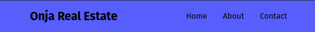
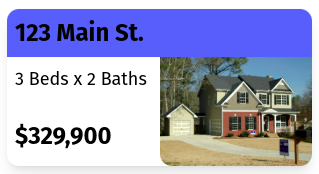
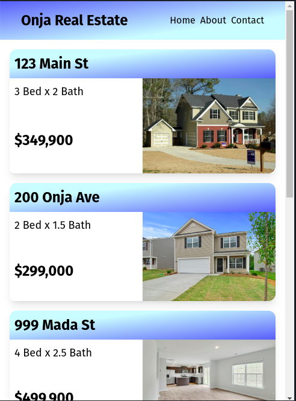
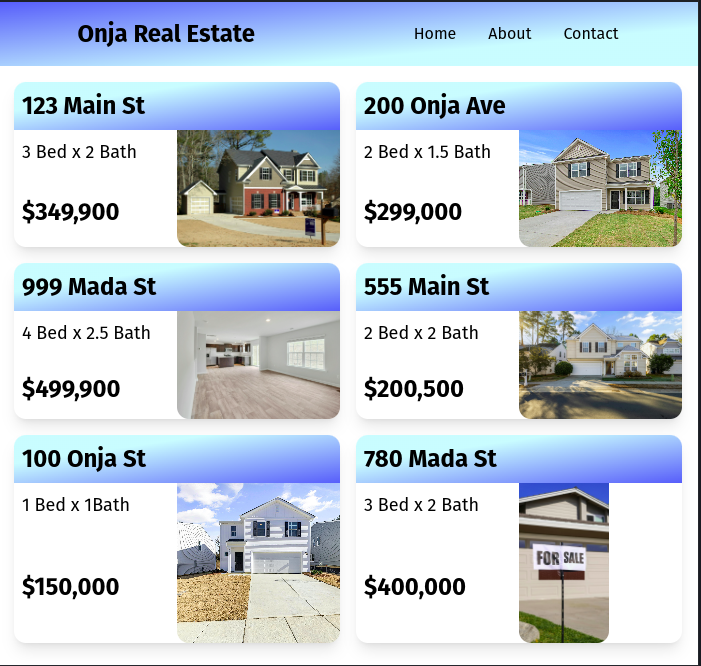

# 💡 CSS Tailwind Layouts Lab

## 🎯 Tasks

**Objective:** ⚡️ Create a realtor app using Grids and Flex with Tailwind. We will not give you the styling classes to use for text elements, use your judgement for text size, weight, padding.

Use the Tailwind CSS docs to understand the different utility classes better.
https://tailwindcss.com/docs/display

### Header

We will use Flex to display our header bar at the top of the page. We'll need a container element with the necessary utility classes to position the header. Then we'll need to list out the elements of our navigation bar.

```
    <div class="flex flex-row justify-around items-center fixed top-0 left-0 right-0 y-0 h-16 bg-blue-500">
        <h1 class="text-2xl font-bold">Onja Real Estate</h1>
        
        <ul class="flex flex-row justify-around items-center sm:gap-8 gap-2">
                <li>Home</li>
                <li>About</li>
                <li>Contact</li>
            </ul>
    </div>
```

You can see the utility classes used here to position the elements with flex, and position the entire header bar at the top of the page. 

`flex` sets the `div` as the flex container, and `flex-row` sets the direction of the inner elements, with `justify-around` and `items-center` aligning the elements along the main and cross axes. 

The inner elements are an `h1` header with the title of the page, and a `ul` with `li` for each nav bar item. Notice the nested `flex` with the `ul` to position the `li` elements in a row rather than vertically. Also notice that we have set the `gap` between the elements to be 8 at the `sm` breakpoint or higher, and 2 if the window is any smaller. 

Your header should look something like this when you're done:



### Main Content Area

The main content area of our page is going to have an overall grid container, containing cards showing the information of houses for sale. Each card will be its own grid, setting the positioning of the house address, information, price, and photo. 

#### Overall Grid

The overall grid will be a `div` with some simple utility classes.

`<div class="grid sm:grid-cols-2 gap-4 p-4 mt-16"></div>`

Again, we use the `sm` to set the number of columns to 2 for screens wider than the small breakpoint. When the screen is smaller than this, it will display the grid items one-by-one down the screen, which is a better user interface for mobile screens. We then set the `gap` to 4, padding to 4, and the top margin to 16 (the height of our header).

#### Section Grids

Each card will be its own `section` container, with a heading containing the house address. Below the heading will be the house information (beds and bathrooms), price, and an image that will span over two rows.

`<section class="grid grid-rows-[auto_1fr] rounded-lg shadow-lg"><section>`

Here we have a custom value for the grid rows. We actually have two custom values, `auto` and `1fr`. This will split the grid into two different sections. The `auto` will adjust the address heading to the size of the text element, and the `1fr` will take up the rest of the container. 

Knowing now that our card will be divided into two parts, with one being the heading, and having multiple items left that we still need to add, you might be able to guess what we need here: another grid!

Take the section above and create the two parts, an `h2` heading and a `div` for our grid container. The grid will have two columns, and two rows. we will have a smaller heading for the house info (beds x bath), an image that will span two rows (with a full height to take up the full space). Try creating these on your own before moving on. 

<details>
<summary>click to see the full nested grid</summary>

```html
<section class="shadow-lg rounded-xl grid grid-rows-[auto_1fr]">
    <h2 class="text-2xl p-2 font-bold rounded-t-xl bg-blue-500">
        123 Main St.
    </h2>
    <div class="grid grid-cols-2 grid-rows-2 max-h-40">
        <h4 class="text-lg p-2">
            3 Beds x 2 Baths
        </h4>
        
        <h2 class="text-2xl rounded-bl-xl font-bold p-2">
            $329,900
        </h2>
    </div>
</section>
```
You can see the different elements here, with a little additional styling by rounding the top of the address heading and bottom of the div to have a more modern look. You might notice we've already rounded the section, why do we need the extra rounded classes? The background color and image cover up the rounded section edges, so we must round these as well to match it. Here is a shot of what your grid might look like now.



</details>

<br>
Once you've got one of these sections complete, you can copy and paste it to have as many as you would like to have. We have six images in the assets directory you can use for the thumbnails, labeled from house1 to house6, you only need to change the number in each `src` url. 


#### Gradients

Now that we have all our houses laid out on the screen, lets try to make our page look a little better than just the solid backgrounds we have now. Tailwind lets you easily use a gradient for your background, with one or multiple colors. 

The utility classes for gradients are simple. You declare it with `bg-gradient-X` where X is the direction you want the gradient to go. For our section grids, we'll use the bottom right, with `bg-gradient-br`. Then we need to give the colors it starts and ends with. The starting color uses `from`, and the finishing color uses `to`. Let's use `from-cyan-500` and `to-blue-500` to have a nice gradient from light blue to a darker blue. If you want to adjust where the gradients start or stop, you can use `from` and `to` with a percentage. Let's use `from-30%` so the gradient doesn't start right away. Feel free to play with the colors, percentages, directions. 

After getting all your section grids finished, we can do the same thing with our main header. To change it up just a bit, I've changed the direction from going to the bottom right, to the top left. Again, try different settings to come up with your own design from what you think looks good.


## Final Result

Once you've completed all the steps above (including the bonus feature), your realtor should look something like this:

Small Screen



Wider Screen (note full screen image sizes will be off, feel free to add min/max height/width to see the differences)


